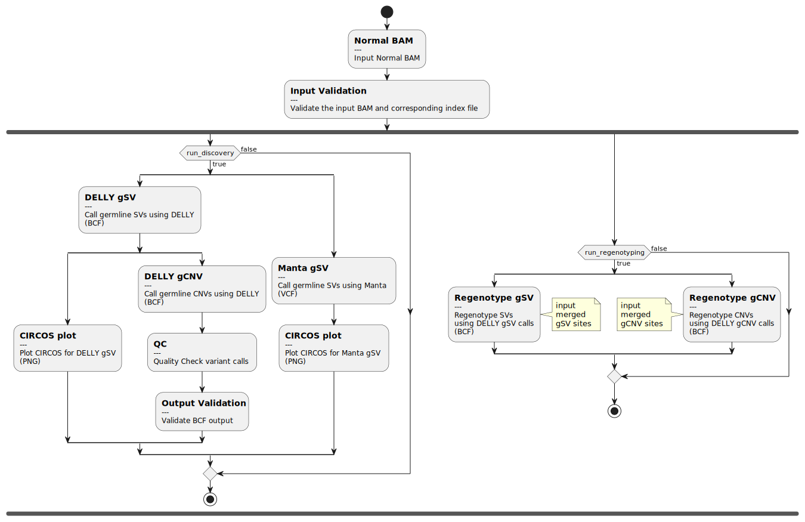

# call-gSV

[](https://github.com/uclahs-cds/pipeline-call-gSV/actions/workflows/prepare-release.yaml)

- [Overview](#overview)
- [How To Run](#how-to-run)
- [Flow Diagram](#flow-diagram)
- [Pipeline Steps](#pipeline-steps)
  - [Discovery](#discovery)
    - [1. Calling Structural Variants](#1-calling-structural-variants)
    - [2. Calling Copy Number Variants](#2-calling-copy-number-variants)
    - [3. Check Output Quality](#3-check-output-quality)
  - [Regenotyping](#regenotyping)
    - [1. Regenotyping Structural Variants](#1-regenotyping-structural-variants)
    - [2. Regenotyping Copy Number Variants](#2-regenotyping-copy-number-variants)
- [Inputs](#inputs)
- [Outputs](#outputs)
- [Testing and Validation](#testing-and-validation)
  - [Test Data Set](#test-data-set)
  - [Performance Validation](#performance-validation)
  - [Quality Check Result Comparison](#quality-check-result-comparison)
  - [Human Genome Benchmarks](#human-genome-benchmarks)
  - [Validation Tool](#validation-tool)
- [References](#references)
- [License](#license)

## Overview

The call-gSV nextflow pipeline, calls structural variants (SVs) and copy number variants (CNVs) utilizing [Delly](https://github.com/dellytools/delly) and [Manta](https://github.com/Illumina/manta). Additionally, the pipeline can also regenotype previously identified SVs or CNVs with Delly. It is suitable for detecting copy-number variable deletion and tandem duplication events as well as balanced rearrangements such as inversions or reciprocal translocations and validates the output quality with [BCFtools](https://github.com/samtools/bcftools).  The pipeline has been engineered to run in a 4 layer stack in a cloud-based scalable environment of CycleCloud, Slurm, Nextflow and Docker.  Additionally it has been validated with the SMC-HET dataset and the GRCh38 reference genome, using paired-end FASTQ's that were back-extracted from BAMs created by BAM Surgeon.


### Node Specific Config File Settings

| Config File | Available Node cpus / memory | Designated Process 1; cpus / memory | Designated Process 2; cpus / memory | Designated Process 3; cpus / memory |
|:------------|:---------|:-------------------------|:-------------------------|:-------------------------|
| `F2.config` | 2 / 3 GB | call_gSV_Delly; 1 / 2 GB | call_gCNV_Delly; 1 / 2 GB | call_gSV_Manta; 1 / 2 GB\* |
| `F16.config` | 16 / 26 GB | call_gSV_Delly; 1 / 8 GB | call_gCNV_Delly; 1 / 8 GB | call_gSV_Manta; 6 / 8 GB |
| `F32.config` | 32 / 62.8 GB | call_gSV_Delly; 1 / 15 GB | call_gCNV_Delly; 1 / 15 GB | call_gSV_Manta; 12 / 15 GB |
| `F72.config` | 72 / 136.8 GB | call_gSV_Delly; 1 / 30 GB | call_gCNV_Delly; 1 / 30 GB | call_gSV_Manta; 24 / 30 GB |
| `M64.config` | 64 / 950 GB | call_gSV_Delly; 1 / 60 GB | call_gCNV_Delly; 1 / 60 GB | call_gSV_Manta; 30 / 60 GB |
---
\* Manta SV calling wouldn't work on an F2 node due to incompatible resources. In order to test the pipeline for tasks not relevant to Manta, please set `run_manta = false` in the sample specific [config](config/template.config) file.

## How To Run

### Requirements
Currently supported Nextflow versions: `v23.04.2`

### Run steps
Below is a summary of how to run the pipeline.  See [here](https://uclahs-cds.atlassian.net/wiki/spaces/BOUTROSLAB/pages/3197004/How+to+run+a+nextflow+pipeline) for full instructions.

Pipelines should be run **WITH A SINGLE SAMPLE AT TIME**. Otherwise resource allocation and Nextflow errors could cause the pipeline to fail.

1. Create a config file for input, output, and parameters. An example for a config file can be found [here](config/template.config). See [Nextflow Config File Parameters](#Nextflow-Config-File-Parameters) for the detailed description of each variable in the config file.

    * Do not directly modify the source `template.config`, but rather you should copy it from the pipeline release folder to your project-specific folder and modify it there

2. Create the input YAML using the [template](input/call-gSV-input.yaml). See [Input YAML](#Input-YAML) for a detailed description.

   * Again, do not directly modify the source template YAML file.  Instead, copy it from the pipeline release folder to your project-specific folder and modify it there.

3. The pipeline can be executed locally using the command below:

```bash
nextflow run path/to/main.nf -config path/to/sample-specific.config -params-file path/to/input.yaml
```

To submit to UCLAHS-CDS's Azure cloud, use the submission script [here](https://github.com/uclahs-cds/tool-submit-nf) with the command below:

```bash
python path/to/submit_nextflow_pipeline.py \
    --nextflow_script path/to/main.nf \
    --nextflow_config path/to/sample-specific.config \
    --nextflow_yaml path/to/input.yaml \
    --pipeline_run_name <sample_name> \
    --partition_type F16 \
    --email <your UCLA email, jdoe@ucla.edu>
```
In the above command, the partition type can be changed based on the size of the dataset. An F16 node is generally recommended for larger datasets like A-full.

> **Note**: Because this pipeline uses an image stored in the GitHub Container Registry, you must follow the steps listed in the [Docker Introduction](https://uclahs-cds.atlassian.net/wiki/spaces/BOUTROSLAB/pages/3190419/Docker+Introduction#DockerIntroduction-HowtosetupPATandlogintotheregistryHowtosetupPATandlogintotheregistry) on Confluence to set up a PAT for your GitHub account and log into the registry on the cluster before running this pipeline.

---

## Flow Diagram



---

## Pipeline Steps

### Discovery

The "discovery" branch of the call-gSV pipeline allows you to identify germline SVs and CNVs utilizing either Delly or Manta. After variants are identified, basic quality checks are performed on the outputs of the processes.

### 1. Calling Structural Variants

The first step of the pipeline requires an aligned and sorted BAM file and BAM index as an input for variant calling with [Delly](https://github.com/dellytools/delly) or [Manta](https://github.com/Illumina/manta). Delly combines short-range and long-range paired-end mapping and split-read analysis for the discovery of balanced and unbalanced SVs at single-nucleotide breakpoint resolution (deletions, tandem duplications, inversions and translocations.) SVs are called, annotated and merged into a single BCF file which is then used to output a gzipped VCF file for user convenience. A default exclude map of Delly can be incorporated as an input which removes the telomeric and centromeric regions of all human chromosomes since these regions cannot be accurately analyzed with short-read data.
Manta calls SVs and indels from mapped paired-end sequencing reads. It is optimized for analysis of germline variation in small sets of individuals and somatic variation in tumor/normal sample pairs. Manta discovers, assembles and scores large-scale SVs, medium-sized indels and large insertions within a single efficient workflow.

Currently the following filters are applied by Delly when calling SVs. Parameters with a "call-gSV default" can be updated in the nextflow.config file.
<br>
| Parameter | Delly default | call-gSV default | Description |
|:------------|:----------|:-------------------------|-------------|
| `svtype` | ALL | | SV type to compute (DEL, INS, DUP, INV, BND, ALL) |
| `map-qual` | 1 | 20 | Minimum paired-end (PE) mapping quality |
| `qual-tra` | 20 |  | Minimum PE quality for translocation |
| `mad-cutoff` | 9 |  | Insert size cutoff, median+s*MAD (deletions only) |
| `minclip` | 25 |  | Minimum clipping length |
| `min-clique-size` | 2 |  | Minimum PE/SR clique size |
| `minrefsep` | 25 |  | Minimum reference separation |
| `maxreadsep` | 40 |  | Maximum read separation |
<br>

### 2. Calling Copy Number Variants

The second step of the pipeline identifies CNVs. To do this, Delly requires an aligned and sorted BAM file, as well as the BCF output from the SV calling step (to refine breakpoints) and a mappability map. Any CNVs identified are annotated and output as a single BCF file. For convenience, the pipeline also outputs a gzipped CNV VCF file.

Currently the following filters are applied by Delly when calling CNVs. Parameters with a "call-gSV default" can be updated in the sample specific nextflow [config](config/template.config) file.
<br>
| Parameter | Delly default | call-gSV default | Description |
|:------------|:----------|:-------------------------|-------------|
| `quality` | 10 |  | Minimum mapping quality |
| `ploidy` | 2 | | Baseline ploidy |
| `sdrd` | 2 | | Minimum SD read-depth shift |
| `cn-offset` | 0.100000001 | | Minimum CN offset |
| `cnv-size` | 1000 | | Minimum CNV size |
| `window-size` | 10000 | | Window size |
| `window-offset` | 10000 | | Window offset |
| `fraction-window` | 0.25 | | Minimum callable window fraction [0,1] |
| `scan-window` | 10000 | | Scanning window size |
| `fraction-unique` | 0.800000012 | | Uniqueness filter for scan windows [0,1] |
| `mad-cutoff` | 3 | | Median + 3 * mad count cutoff |
| `percentile` | 0.000500000024 | | Excl. extreme GC fraction |
<br>

### 3. Check Output Quality

For Delly, VCF files are generated from the BCFs to run the vcf-validate command from [VCFTools](https://vcftools.github.io/perl_module.html#vcf-validator) and vcfstats from [RTGTools](https://cdn.rawgit.com/RealTimeGenomics/rtg-tools/master/installer/resources/tools/RTGOperationsManual/rtg_command_reference.html#vcfstats).  Outputs from both provide preliminary summary statistics that can be viewed and evaluated in preparation for downstream cohort-wide re-calling and re-genotyping. In the Manta branch of the pipeline, a stats directory is generated under the specific output directory <outputDirectory>/Manta-<version number>/results/stats where information can be found regarding the SVs identified.
<br>

### Regenotyping

The "regenotyping" branch of the call-gSV pipeline allows you to regenotype previously identified SVs or CNVs using Delly.

### 1. Regenotyping Structural Variants

Similar to the "discovery" process, the first step of the regenotyping pipeline requires an aligned and sorted BAM file, BAM index, and a merged sites BCF (from the merge-SVsites pipeline) as inputs for SV regenotyping with [Delly](https://github.com/dellytools/delly). The provided sample is genotyped with the merged sites list. SVs are annotated and merged into a single BCF file. A default exclude map of Delly can be incorporated as an input which removes the telomeric and centromeric regions of all human chromosomes since these regions cannot be accurately analyzed with short-read data.
<br>

### 2. Regenotyping Copy Number Variants

The second possible step of the regenotyping pipeline requires an aligned and sorted BAM file, BAM index, and a merged sites BCF as an input, as well as the BCF output from the initial SV calling (to refine breakpoints) and a mappability map. Any CNVs identified are annotated and output as a single BCF file.
<br>

---

## Inputs

### Input YAML

| Field | Type | Description |
|:------|:-----|:------------|
| sample_id | string | Sample ID |
| normal | path | Set to absolute path to input BAM |

```
---
input:
  BAM:
    normal:
      - "/path/to/input/BAM"
```
> Note: This pipeline is designed to detect germline SVs. To maintain consistency with other Boutros Lab Nextflow pipelines, the input YAML format mirrors that of other somatic or germline variant calling pipelines. However, it's important to note that the sample type tags, whether labeled as `normal` or `tumor`, do NOT influence the germline SV/CNV calling processes in this pipeline.

### Nextflow Config File Parameters

| Input Parameter | Required | Type | Description |
|:----------------|:---------|:-----|:------------|
| `dataset_id` | yes | string | Boutros lab dataset id. |
| `blcds_registered_dataset` | yes | boolean | Affirms if dataset should be registered in the Boutros Lab Data registry. Default value is `false`. |
| `genome_build` | no | string | Genome build for circos plot, `hg19` or `hg38`. Default is set to `hg38` |
| `variant_type` | yes | list | List containing variant types to call. Default is `["gSV", "gCNV"]` |
| `run_discovery` | yes | boolean | Specifies whether or not to run the "disovery" branch of the pipeline. Default value is `true`. (either `run_discovery` or `run_regenotyping` must be `true`) |
| `run_regenotyping` | yes | boolean | Specifies whether or not to run the "regenotyping" branch of the pipeline. Default value is `false`. (either `run_discovery` or `run_regenotyping` must be `true`) |
| `merged_sites` | yes | path | The path to the merged sites.bcf file. Must be populated if running the regenotyping branch. |
| `run_delly` | true | boolean | Whether or not the workflow should run Delly (either run_delly or run_manta must be set to `true`) |
| `run_manta` | true | boolean | Whether or not the workflow should run Manta (either run_delly or run_manta must be set to `true`) |
| `run_qc` | no | boolean | Optional parameter to indicate whether subsequent quality checks should be run on Delly outputs. Default value is `false`. |
| `reference_fasta` | yes | path | Absolute path to the reference genome `FASTA` file. The reference genome is used by Delly for SV calling. |
| `exclusion_file` | yes | path | Absolute path to the delly reference genome `exclusion` file utilized to remove suggested regions for SV calling. On Slurm, an HG38 exclusion file is located at `/example/delly/excludeTemplates/human.hg38.excl.tsv` |
| `mappability_map` | yes | path | Absolute path to the delly mappability map to support GC and mappability fragment correction in CNV calling |
| `map_qual` | no | path | minimum paired-end (PE) mapping quaility threshold for Delly. |
| `save_intermediate_files` | yes | boolean | Optional parameter to indicate whether intermediate files will be saved. Default value is `false`. |
| `output_dir` | yes | path | Absolute path to the directory where the output files to be saved. |
| `work_dir` | optional | path | The path to a temporary working directory for Nextflow, storing intermediate files and logs. It is recommended to use fast, local storage with high I/O performance. |
| `docker_container_registry` | optional | string | Registry containing tool Docker images. Default: `ghcr.io/uclahs-cds` |

An example of the NextFlow Input Parameters Config file can be found [here](config/template.config).

### Base resource allocation updaters
To optionally update the base resource (cpus or memory) allocations for processes, use the following structure and add the necessary parts to the [input.config](config/template.config) file. The default allocations can be found in the [node-specific config files](./config/)

```Nextflow
base_resource_update {
    memory = [
        [['process_name', 'process_name2'], <multiplier for resource>],
        [['process_name3', 'process_name4'], <different multiplier for resource>]
    ]
    cpus = [
        [['process_name', 'process_name2'], <multiplier for resource>],
        [['process_name3', 'process_name4'], <different multiplier for resource>]
    ]
}
```
> **Note** Resource updates will be applied in the order they're provided so if a process is included twice in the memory list, it will be updated twice in the order it's given.
Examples:

- To double memory of all processes:
```Nextflow
base_resource_update {
    memory = [
        [[], 2]
    ]
}
```
- To double memory for `call_gSV_Delly` and triple memory for `run_validate_PipeVal` and `call_gSV_Manta`:
```Nextflow
base_resource_update {
    memory = [
        ['call_gSV_Delly', 2],
        [['run_validate_PipeVal', 'call_gSV_Manta'], 3]
    ]
}
```
- To double CPUs and memory for `call_gSV_Manta` and double memory for `run_validate_PipeVal`:
```Nextflow
base_resource_update {
    cpus = [
        ['call_gSV_Manta', 2]
    ]
    memory = [
        [['call_gSV_Manta', 'run_validate_PipeVal'], 2]
    ]
}
```

---

## Outputs

| Output | Description |
|:-------|:------------|
| `.bcf` | Binary VCF output format with SVs if found. |
| `.bcf.csi` | CSI-format index for BCF files. |
| `.vcf.gz` | Compressed VCF output format with SVs if found. |
| `.vcf.gz.tbi` | TBI-format index for VCF files. |
| `.png` | SV Circos plot for individual SV callers as QC output. |
| `.validate.txt` | output file from vcf-validator. |
| `.stats.txt` | output file from RTG Tools. |
| `report.html`, `timeline.html` and `trace.txt` | A Nextflow report, timeline and trace files. |
| `*.log.command.*` | Process and sample specific logging files created by nextflow. |
| `*.sha512` | generates SHA-512 hash to validate file integrity. |
---

## Testing and Validation

### Test Data Set

Testing was performed leveraging aligned and sorted BAMs generated using `bwa-mem2-2.1` against reference GRCh38 (SMC-HET was aligned against hs37d5):

* **A-mini:**    BWA-MEM2-2.1_TEST0000000_TWGSAMIN000001-T001-S01-F.bam
* **A-partial:** BWA-MEM2-2.1_TEST0000000_TWGSAPRT000001-T001-S01-F.bam
* **A-full:**    a-full-CPCG0196-B1.bam\*
* **A-partial**:   CPCG0196-B1-downsampled-a-partial-sorted.bam\*
* **SMC-HET:**    HG002.N.bam

\* In Delly `v1.1.3`, a `coverage check` has been introduced which checks for coverage quality in a given window before CNV calling. Successful CNV calling was observed on samples with coverages across the genome, such as, `a-full-CPCG0196-B1.bam` and `CPCG0196-B1-downsampled-a-partial-sorted.bam` (WGS samples). For more details, please refer to Discussion [#64](https://github.com/uclahs-cds/pipeline-call-gSV/discussions/64).

Test runs for the A-mini/partial/full samples were performed using the following reference files

* **reference_fasta:** /example/genome/GRCh38-BI-20160721/Homo_sapiens_assembly38.fasta
* **exclusion_file:** /example/delly/excludeTemplates/human.hg38.excl.tsv
* **mappability_map:** /example/delly/mappabilityMaps/Homo_sapiens.GRCh38.dna.primary_assembly.fa.r101.s501.blacklist.gz

### Performance Validation

#### with Delly <= `v0.9.1` in the pipeline
Testing was performed primarily in the Boutros Lab Slurm Development cluster but additional functional tests were performed on the SGE cluster on 2/26/2021 and the Slurm Covid cluster.  Metrics below will be updated where relevant with additional testing and tuning outputs.

|Test Case | Test Date | Node Type | Duration | CPU Hours | Virtual Memory Usage (RAM) -peak rss |
|:---------|:----------|:----------|:---------|:----------|:---------------------------|
| A-mini | 2021-02-12 | F2 | 1m 29s | a few seconds | 208.8 MB |
| A-partial | 2021-02-10 | F72 | 42m 5s | 48.8 | 8.9 GB |
| A-full | 2021-02-10 | F72 | 7h 10m 43s | 509.0 | 10.9 GB |
| SMC-HET | 2021-02-12 | F72 | 3h 9m 60s | 223.5 |  8.9 GB |

#### with Delly >= `v1.0.3` in the pipeline
Metrics below are based on the integration of Delly v1.13 in the `call-gSV` pipeline.

|Test Case | Test Date | Node Type | Duration | CPU Hours | Virtual Memory Usage (RAM) -peak rss |
|:---------|:----------|:----------|:---------|:----------|:---------------------------|
| CPCG0196-B1 A-partial | 2022-08-08 | F72 | 1h 9m 15s | 2.2 | 10.85 GB |
| CPCG0196-B1 A-full  | 2022-08-06 | F72 | 21h 3m 19s | 37.3 | 24.68 GB |


### Quality Check Result Comparison

|Metric | A-mini | A-partial | A-full | SMC-HET | Source |
|:------|:------|:---------|:------|:--------|:-------|
| Count Pass | 3 | 2593 | 62704 | 15196 | `grep -c -w  "PASS" filename.vcf -1` |
| Count Deletion | 2 | 1475 | 49433 | 9317 | `grep -c -w  "SVTYPE=DEL" filename.vcf` |
| Count Duplication | 1 | 170 | 2311| 1705 | `grep -c -w  "SVTYPE=DUP" filename.vcf` |
| Count Inversion | 0 | 317 | 2801 | 2197 | `grep -c -w  "SVTYPE=INV" filename.vcf` |
| Count Translocation | 0 | 384 | 7439 | 0 | `grep -c -w  "SVTYPE=BND" filename.vcf` |
| Count Insertion | 0 | 267 | 1265 | 2059 | `grep -c -w  "SVTYPE=INS" filename.vcf` |
| PRECISE Calls | 3 | 1850 | 11541 | 8267 | `grep -c -w  "PRECISE" filename.vcf` |
| IMPRECISE Calls | 2 | 764 | 51709 | 7012 | `grep -c -w  "IMPRECISE" filename.vcf` |
| Failed Filters | 0 | 653 | 44991 | 2619 | `.stats.txt` |
| Passed Filters | 3 | 1959 | 18257 | 12658 | `.stats.txt` |
| SV breakends | 0 | 219 | 1124 | 0 | `.stats.txt` |
| Symbolic SVs | 2 | 1559 | 12500 | 11156 | `.stats.txt` |
| Same as reference | 1 | 263 | 4595 | 1471 | `.stats.txt` |
| Missing Genotype | 0 | 8 | 38 | 31 | `.stats.txt` |
| Total Het/Hom ratio | (2/0) | 1.00 (843/845) | 2.37 (9580/4044) | 1.86 (7251/3905) | `.stats.txt` |
| Breakend Het/Hom ratio | (0/0) | 0.84 (59/70) | 13.41 (1046/78) | (0/0) | `.stats.txt` |
| Symbolic SV Het/Hom ratio | (2/0) | 1.01 (784/775) | 2.15 (8534/3966) | 1.86 (7251/3905) | `.stats.txt` |
| Duplicate entries | 0 errors total | 1 error chr8:3893339  | 1 error chr1:16050024 | 1 error chr1:187464829 | `.validate.txt` |

### Human Genome Benchmarks
Note, per Nature the following benchmarks exist for the human genome:
“Structural variants affect more bases: the typical genome contains an estimated **2,100 to 2,500 structural variants** (∼1,000 large deletions, ∼160 copy-number variants, ∼915 Alu insertions, ∼128 L1 insertions, ∼51 SVA insertions, ∼4 NUMTs, and ∼10 inversions), affecting ∼20 million bases of sequence.”

### Validation Tool

Included is a template for validating your input files. For more information on the tool check out: https://github.com/uclahs-cds/public-tool-PipeVal

---

## References

1. [Rausch T, Zichner T, Schlattl A, Stütz AM, Benes V, Korbel JO. DELLY: structural variant discovery by integrated paired-end and split-read analysis. Bioinformatics. 2012;28(18):i333-i339. doi:10.1093/bioinformatics/bts378](https://www.ncbi.nlm.nih.gov/pmc/articles/PMC3436805/)
2. Chen, X. et al. (2016) Manta: rapid detection of structural variants and indels for germline and cancer sequencing applications. Bioinformatics, 32, 1220-1222. [doi:10.1093/bioinformatics/btv710](https://academic.oup.com/bioinformatics/article/32/8/1220/1743909)
3. [VCFtools - vcf-validator](https://vcftools.github.io/perl_module.html#vcf-validator)
4. [Real Time Genomics RTG Tools Operations Manual - vcfstats](https://cdn.rawgit.com/RealTimeGenomics/rtg-tools/master/installer/resources/tools/RTGOperationsManual/rtg_command_reference.html#vcfstats)
5. [Boutros Lab -CallSV Quality Control pipeline]()
6. [The 1000 Genomes Project Consortium., Corresponding authors., Auton, A. et al. A global reference for human genetic variation. Nature 526, 68–74 (2015). https://doi.org/10.1038/nature15393](https://www.nature.com/articles/nature15393)

## Contributors
Please see list of [Contributors](https://github.com/uclahs-cds/pipeline-call-gSV/graphs/contributors) at GitHub.

## License

The pipeline-call-gSV is licensed under the GNU General Public License version 2. See the file LICENSE for the terms of the GNU GPL license.

The pipeline-call-gSV takes BAM and BCF files and utilizes Delly to call/regenotype gSV/gCNV.

Copyright (C) 2021-2025 University of California Los Angeles ("Boutros Lab") All rights reserved.

This program is free software; you can redistribute it and/or modify it under the terms of the GNU General Public License as published by the Free Software Foundation; either version 2 of the License, or (at your option) any later version.

This program is distributed in the hope that it will be useful, but WITHOUT ANY WARRANTY; without even the implied warranty of MERCHANTABILITY or FITNESS FOR A PARTICULAR PURPOSE. See the GNU General Public License for more details.
